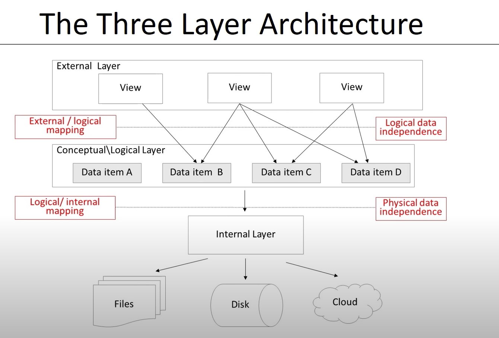
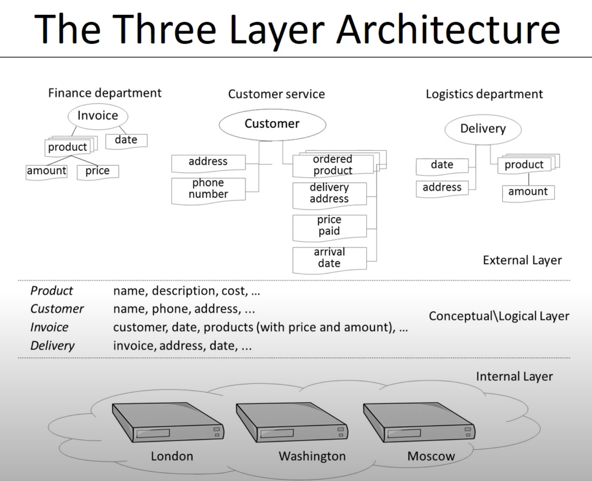

# Introduction

# Application of Database Technology

youtube, spotify, fitbit, google maps, warmart, bigdata application.

Walmart
point of sales - POS
which product most sales
purchase prediction

Database Management System (DBMS)

product properties, relates supplies
purchase order, relates with supplier
supply properties,

Oracle, IBM , Microsoft
MySQL open source

## File vs Database Approach to Data Management

Costumer Relation Management
Each program stores data in file.. make everything insconsistent

file approach  -  lots of individual coding
DB approach - structure query language SQL
      * SELECT * FROM Costumer Where name = "Bart"

## Elements of a Database System
* DB model vs instances
  DB models or DB schema, relationships, constraints, detail
  students (number, name, address, email)
  Course(number, name)
  Building(class, etc )
* Data model
  unabigious charecterist, good defined relationships
  this is communication instrument between information architect and business Users
  Enhanced-Entity relationships EER
  object-oriented models
  logical data model are translational and canbe hierarchical, CODASYL, relational, object-oriened, extended relational, XML or NoSQL model
  pysical storage details, which data is stored where, in what format, highly dbms specificded
  External data models contains subset of data items also called views... tailored towards the needs of specific application
* The tree layer architeture
  
  student view only for student registratio office
  
* Catalog
  heart of dbms
  contains data definitions or metadata
  stores the definitions of the views logical and internal data models
* Database Users
  DBA database administrator.
  application developer
  business user run application
* DB languages
  DDL data definition language
  DML data manipulation language
    insert, delete, modify data
  SQL offers both DDL and DML

## Advantages of DB and DBMS
### data independence,
  changes in data definitions have minimal impact on application
  physical data independence if data storage specification in the internal data model changes application, view or logical data models should not be affected
  logical data independence means software application are minimal affected by changes in the conceptual or logical data model.
### data modelling,
  different model
### managing structured, semi-structured and unstructured data.
 number, name etc
  * unstructured data
  no series of charecter, long text...
  the size exceeding the structure data
  * semi-structure
  irregular, XML nosql databases, cvs etc...
### managing data redundancy
  should be no duplication,
  no human intervation
### specifying integrity rules
  costumer id is integer
  birthdate m/d/y
  Semantical rules semantical correctness..
### Concurrency Control
  paralel processing.
  databese write and read executation...
  at the same time, atomic time
  lost update problem
  eliminate simultinous application
  ACID Atomicity, Consistency, Isolation, Durability
  Atomicity requires a transaction should either be executed in its entirety or not all
  Consistency brings the db from one consistent state to another
  Isolation the effect of concurrent transactions should be the same as if they would have been executed in isolation
  Durability db changes made by a transaction declared successful can be made permanent under all circumtances
### backup and recovery facilities
  bugs or network failures.
  perform full or incremantal update
### data security
  users can read, write previlages
  VMI vendor managed inventory.
### performance utilities
  KPI are three
  response time db request and termination
  throughput rate process per unit time
  space utilization space raw data
  utilities that optimize data storage, tune index for faster query execution, optimize buffer management
