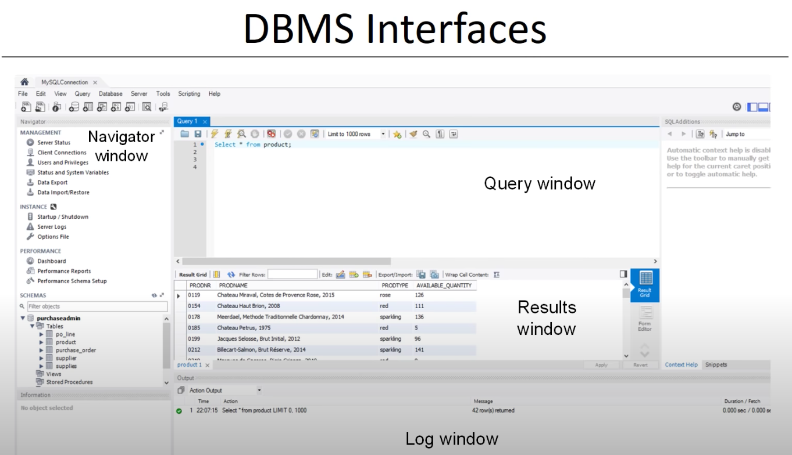

# Architecture and Classification of DBMS

# Architecture of DBMS

## Connection and Security manager

* username, password. login credentials
* multiple process, multi threads
* read versus write access

## DDL compiler

3 DDL (internal, logical, extermanl data model)
* SQL is as DDL
* parse defination, check errors
* after compilation and register to DBMS

## Query processor

* assist retrieval, insertion update or removal data
* query parser, rewriter, otimizer etc

## DML compiler (data manipulation language)

Procedural DML

* how to navigate db
* no query processor
* record at a time

Declarative DML (not prefered) SQL
* what data, what changes
* query processor
* set at a time

## DML Compiler

* impedance mismatch problem

Mapping between java and SQL concepts

* Impedance mismatch solutions

### Query parser and Query rewriter

syntactival semantical correctness

### Query optimzer

* predefined indexes
* number of I/O operations
* CPU processing cost
* execution time
* is key competitive asset of a DBMS

### Query executer

## Storage Manager

### Transaction Manager
supervises execution of db. read and write. ACID properties.
* commit or rollback transactions

### Buffer manager

internal memory, cacheing speedy access.
* data locality: data recently retrieved is likely to be retrieved again
* 80% data is read and 20% is write only

### lock manager
* concurrency control > data integrity at all times
* read and write locks
* avoid conflicts
* locking protocols

### recovery manager
* to undo actions, observes transactions

### DBMS interfaces
* web-base
* commandline
* admin
* network etc

# Category of DBMS

## Data model

### Hierarchical DBMS

* tree like
* DML procedural and record oriented
* no query processor
* IMS(IBM)

### Network DBMS

* network
* CODASYL DBMSs
* DML procedural and record oriented
* no query processor

### Relational DBMS

* relational data models
* most populer
* SQL (declarative and set oriented)
* query processor
* strict separation between logical and internal data models (data independence)
* MySQL (Oracle), Oracle DBMS, DB2 (IBM), Microsoft SQL

## degree of simultaneous access

## architecture

## usage
