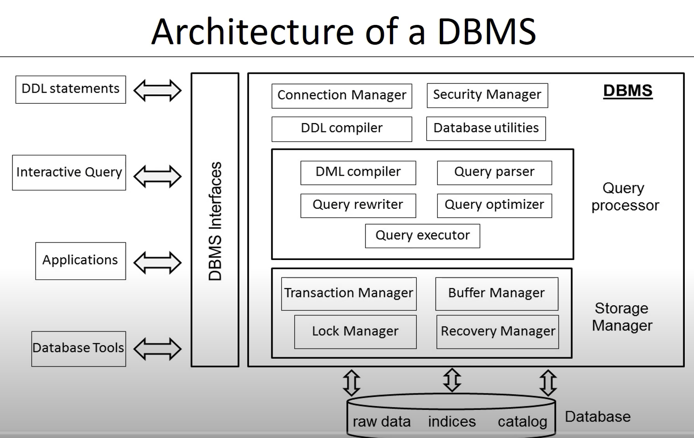

# Architecture and Classification of DBMS

# Architecture of DBMS

## Connection and Security manager

* username, password. login credentials
* multiple process, multi threads
* read versus write access

## DDL compiler

3 DDL (internal, logical, extermanl data model)
* SQL is as DDL
* parse defination, check errors
* after compilation and register to DBMS

## Query processor

* assist retrieval, insertion update or removal data
* query parser, rewriter, otimizer etc

## DML compiler (data manipulation language)

Procedural DML

* how to navigate db
* no query processor
* record at a time

Declarative DML (not prefered) SQL
* what data, what changes
* query processor
* set at a time

## DML Compiler

* impedance mismatch problem

Mapping between java and SQL concepts

* Impedance mismatch solutions

## Storage Manager

# Category of DBMS
